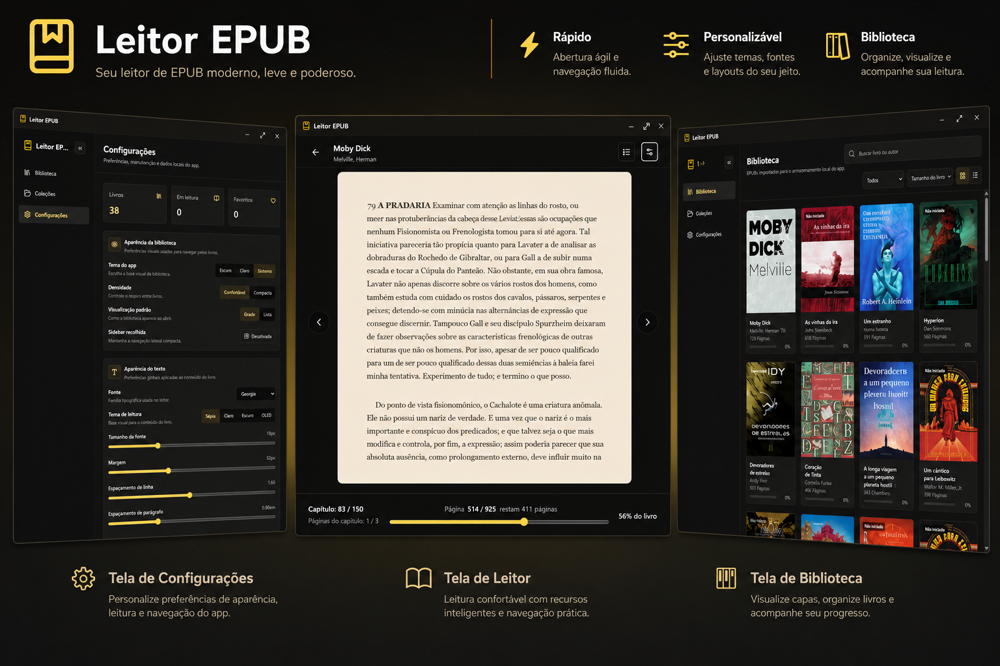
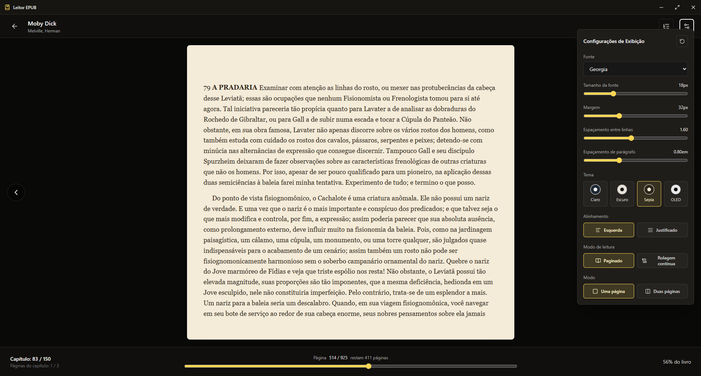
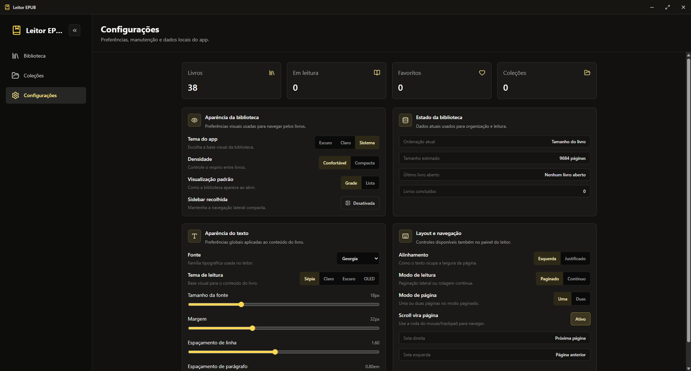

# Leitor EPUB

Leitor EPUB desktop moderno, local e offline, inspirado na experiência de leitura de apps como Kindle, mas com foco em privacidade, controle do usuário e organização da biblioteca no próprio dispositivo.

<p align="center">
  
  
  
  
  
  
</p>



## Recursos

- Biblioteca local com armazenamento no dispositivo.
- Importação de arquivos `.epub`.
- Organização por coleções.
- Favoritos, filtros, busca local na biblioteca e ordenação.
- Visualização em grade ou lista.
- Leitura paginada ou por rolagem contínua.
- Navegação por sumário.
- Persistência automática do progresso de leitura.
- Ajustes de fonte, margem, alinhamento, espaçamento, tema e modo de página.
- Temas de leitura claro, escuro, sépia e OLED.
- Leitura offline.
- Sanitização básica do conteúdo renderizado no leitor.

## Pré-requisitos

| Ferramenta       | Versão recomendada | Link                                                    |
| ---------------- | ------------------ | ------------------------------------------------------- |
| Node.js          | 22+                | https://nodejs.org                                      |
| npm              | incluso no Node.js | https://www.npmjs.com                                   |
| Rust             | stable             | https://www.rust-lang.org/tools/install                 |
| WebView2 Runtime | atual              | https://developer.microsoft.com/microsoft-edge/webview2 |

No Windows, o WebView2 normalmente já vem instalado. Se a janela do app não abrir corretamente, instale ou atualize o runtime.

## Instalação

Clone o repositório:

```powershell
git clone https://github.com/ViniciusTaglieri/EpubReader
cd EpubReader
```

Instale as dependências:

```powershell
npm ci
```

Rode o app desktop em desenvolvimento:

```powershell
npm run tauri dev
```

## Screenshots

### Biblioteca


### Leitor



### Configurações



## Stack

- **Tauri v2**: empacotamento desktop e ponte nativa.
- **Rust**: filesystem, persistência, parsing, storage e comandos.
- **React 19**: interface do usuário.
- **TypeScript 6**: tipagem estática no frontend.
- **SQLite**: biblioteca, coleções, progresso e dados locais.
- **epub.js**: renderização EPUB.
- **Tailwind CSS**: sistema visual e responsividade.
- **Vitest + Testing Library**: testes do frontend.
- **Biome + ESLint**: formatação, lint e padronização.

## Arquitetura

```txt
src/
  features/
    library/      Biblioteca, coleções, filtros, preferências e importação
    reader/       Leitor EPUB, paginação, sumário e ajustes de leitura
    annotations/  Camadas iniciais de destaques e anotações
  shared/
    components/   Componentes reutilizáveis
    tauri/        Cliente dos comandos nativos
    types/        Tipos compartilhados do frontend

src-tauri/
  src/
    commands/     Comandos expostos ao frontend
    db/           Schema, migrations e repositories SQLite
    epub/         Parser, manifesto, validação, recursos e texto
    storage/      Paths, staging e manipulação de arquivos locais
```

## Contribuindo

Contribuições são bem-vindas.

1. Crie uma branch a partir da `main`.
2. Faça mudanças pequenas e focadas.
3. Rode `npm run check` antes de enviar.
4. Inclua testes quando alterar regras, parsing, filtros, persistência ou comportamento do leitor.
5. Abra um Pull Request descrevendo motivação, mudanças e evidências de teste.

## Licença

Distribuído sob a licença MIT. Veja [LICENSE](LICENSE) para mais detalhes.
